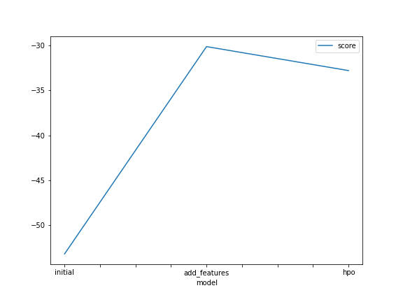
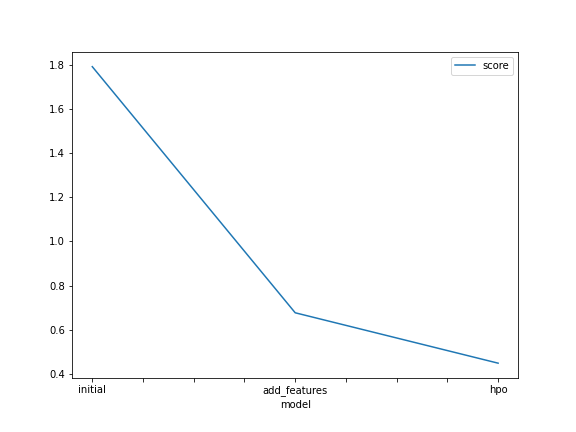

# Report: Predict Bike Sharing Demand with AutoGluon Solution
#### AJAYI JOHN

## Initial Training
### What did you realize when you tried to submit your predictions? What changes were needed to the output of the predictor to submit your results?
TODO: Add your explanation
Kaggle rejects negative score values, hence, the negative values was set to zero before submission

### What was the top ranked model that performed?
TODO: Add your explanation
The top ranked model that performed is the "WeightedEnsemble_L3" with a score  of and RMSE value of -52.55. RMSE evaluation metric was used. Hence, the lower the error, the better the model.

## Exploratory data analysis and feature creation
### What did the exploratory analysis find and how did you add additional features?
TODO: Add your explanation
The temp and atemp features are almost perfectly skewed, indicating that the temperature range is almost the same all through the week. 
The causal users, windspeed, registered and count columns are left-skewed. This is an indicator that  do not have particular periods of the day to lend a bike.
The other columns are simply discrete values

### How much better did your model preform after adding additional features and why do you think that is?
TODO: Add your explanation
After adding additional features, the model inproved significantly. This included also converting certain features to categorical variables.
From an initial RMSE value of -52 to RMSE value of -33.7124. Also, the kaggle score improved from ... to ...

## Hyper parameter tuning
### How much better did your model preform after trying different hyper parameters?
TODO: Add your explanation
Tuning of some of the hyerparameters also improved the model's performace
Some of the hyperparameters that were tuned included 

### If you were given more time with this dataset, where do you think you would spend more time?
TODO: Add your explanation

### Create a table with the models you ran, the hyperparameters modified, and the kaggle score.
|model|hpo1|hpo2|hpo3|score|
|--|--|--|--|--|
|initial|?|?|?|?|
|add_features|?|?|?|?|
|hpo|?|?|?|?|

### Create a line plot showing the top model score for the three (or more) training runs during the project.

TODO: Replace the image below with your own.

### Create a line plot showing the top kaggle score for the three (or more) prediction submissions during the project.

TODO: Replace the image below with your own.

## Summary
TODO: Add your explanation
